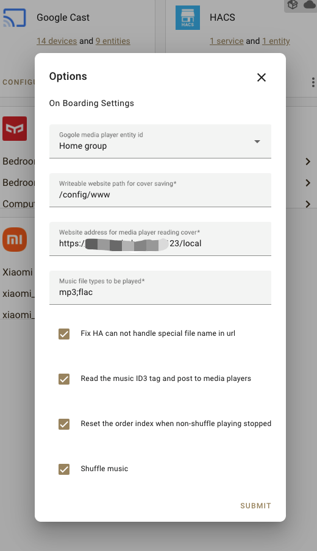
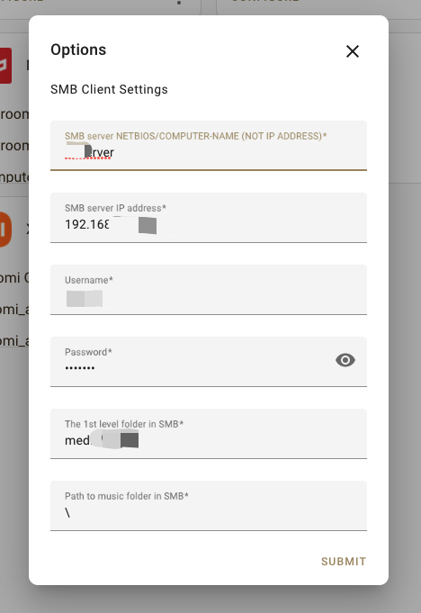
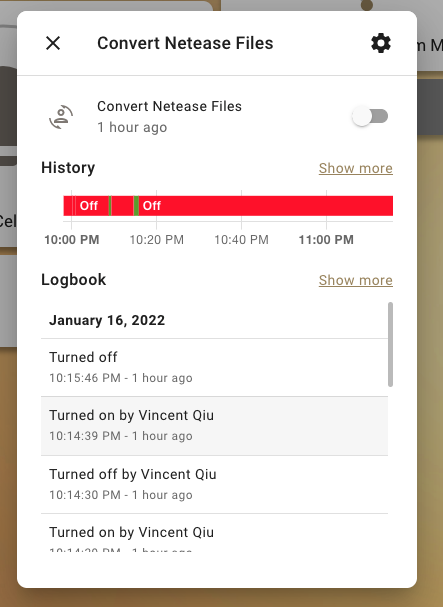

# HomeAssistant Chromecast Media Center (HA 谷歌音响媒体中心)

This is an uncompleted project, which will be coding during I have time but won't be finished soon as
the [ha-hoho-google-media-centre](https://github.com/nov30th/ha-hoho-google-media-center) is working normally.

这是一个未完成的项目，仅在我有时间时候进行编码，很有可能一段时间不进行更新。

Please notice that this component won't able to play music currently!

Currently, I made it for converts the **ncm** file to normally music file only.

Welcome PR

## Features/Functions Finished (已完成功能)

- [x] Shows in **Integrations** (显示在集成界面)
- [x] Configuration verifying and saving in Integrations (在集成界面完成所有配置并自动验证)
- [x] Fully SMB supports (Windows文件夹共享支持)
- [x] Netease music '.ncm' file converting automatically in SMB (自动转换共享文件夹ncm文件到普通音乐文件)
- [ ] Play music and basic functions in **ha-hoho-google-media-centre** (基本功能)
- [ ] Supports local music files playing (支持本地音乐文件播放)
- [ ] Other functions/features (其他的功能)

## Screenshots

### Options

### Switches
The switch will off once all ncm files been converted,

this process will deletes all ncm files and saves the mp3/flac files into the SMB.

